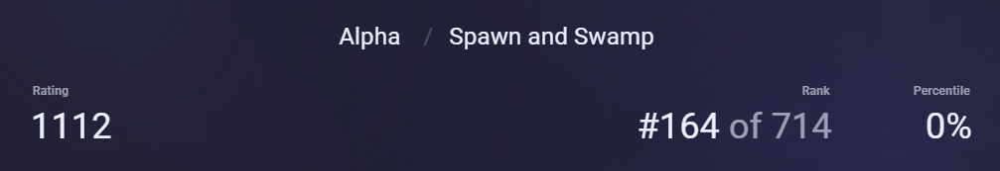

# Screeps-Arena-Personal-Bot

## Rating



Recorded on 2023/06/24;

## Introduction
This is my personal bot for [Screeps: Arena](https://store.steampowered.com/app/1137320/Screeps_Arena/).

Currently, it only supports the SAS (spawn and swamp) mode.

The team consists of melee soldiers and healers.

## How to use

Due to certain unknown reasons, I am unable to choose ```spawn_and_swamp``` folder directly in the game.

If you encounter the same problem, simply select an empty folder in the game and replace its content with the content of the ```spawn_and_swamp``` folder.

## Features

- [x] Escaping from attackable enemy creeps.
- [x] Creeps in same group move together.
- [x] Notifying nearby ally creeps when a creep is about to attack.
- [] Defending system
- [] Evaluating whether creeps have an advantage in the upcoming battle.
- [] Avoiding disadvantaged battle.

### Considering
- [] Building structure
- [] Ranged attack creep.


## Project structure

- ```subSystem```
    - For different specific tasks, such as spawn, attack, work, etc.

- ```customPrototypes```
    - Extending more properties or methods in the original game prototype.

- ```creepsTypeManager```
    - Maintaining the status of different types of creeps.

- ```structureManager```
    - Maintain the status of different types of structures.

- ```utils.mjs```
    - Some functions that have not been owned by any classes.

- ```handler```
    - Classes that haven not been classified.
